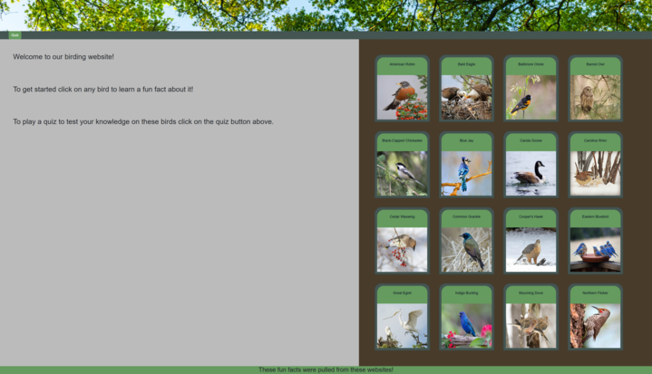
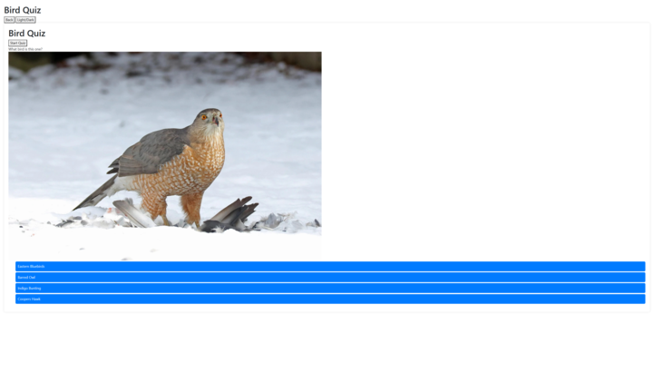

# Pets-Who
<!-- 
    ^ ^
   (.↓.)
 /)(( ))(\
    ^ ^      -->

  
## Description
Pets-Who was developed by a team of pet and bird lovers. We want to share our knowledge of birds on this interactive site where the user can learn information about several types of birds. 
When the user clicks on a bird, the image will provide infromation about that bird. The user can also interact with a quiz about these birds linked on a separate page.  
Our site will provide comments on answers and incorrect answers based on the users interactions. Our Team has learned so much about these avian friends and hope that you will enjoy it too!

## Usage

## Credits: Pets-Who collaborators:

Fischer Almanza     https://github.com/Falmanza94 
Mina Draper-Hammond https://github.com/VampMina528  
Jeremiah Falk       https://github.com/jedfalk
Stephen Schier      https://github.com/SSgrandslam7

## Third-party Sources:

https://www.audubon.org/
https://cbop.audubon.org/
https://statesymbolsusa.org/categories/bird
https://www.allaboutbirds.org/
https://www.lyricbirdfood.com/birding-hub

## Features

* Images and information about several birds
* Quiz interactivity utilizing the information provided about each bird
* Quiz score tracking
* Light and dark modes
* Links to sources

(.>            
/))           
"               

🏛️ Pets-Who
https://falmanza94.github.io/pets-who/